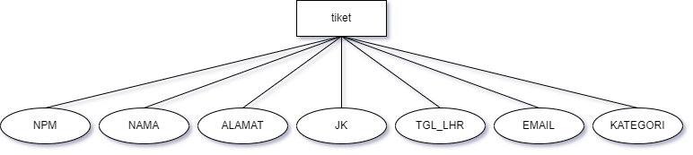

  <h2 align="center">
    PROJECT PEMBELIAN TIKET ANAK SMP
  </h2>

 

<!-- Daftar Isi -->

  
<h2 style="display: inline-block">Daftar Isi</h2>

  <ol>
    <li><a href="#anggota-tim">Anggota Tim</a></li>
    <li><a href="#fungsi">Fungsi</a></li>
    <li><a href="#tujuan">Tujuan</a></li>
    <li><a href="#target-pengguna">Target Pengguna</a></li>
    <li><a href="#mockup-kasar-sederhana">Mockup Kasar Sederhana</a></li>
    <li><a href="#skema-database">Skema Database</a></li>
  </ol>

<!-- Anggota Tim -->
## Anggota Tim
| NPM           | Name               |
| ------------- | ------------------ |
| 140810210051  | Satria Alief P. H. |
| 140810210053  | Hermanu Widyatama  |
| 140810210059  | Prames Ray Lapian  |

<!-- Fungsi -->
## Fungsi
  Fungsi dari website kami yaitu peminat dapat menghemat waktu dan juga tenaga dalam membeli tiket karena tidak perlu repot repot datang ke tempat langsung untuk membelinya. Sedangkan manfaat untuk kami yaitu kami dapat mengimplementasikan materi yang sudah kami terima ke dalam proyek ini

<!-- Tujuan -->
## Tujuan
  Website yang kita buat bertujuan agar dapat mengetahui informasi, rangkaian dan bahkan dapat membeli tiket dari suatu event dari rumah masing masing. Jadi peminat acara tersebut tidak perlu repot mencari info di sana sini dan tidak perlu datang ke tempat event secara langsung.

<!-- Target Pengguna -->
## Target Pengguna
  Seluruh masyarakat yang tertarik dengan sebuah event, terutama anak muda.

<!-- Mockup Kasar Sederhana -->
## Gambar Rancangan Antarmuka
  Rencana website yang kami buat berisi tentang informasi lengkap dari berbagai macam event seperti tanggal, bintang tamu, jam, lokasi, dsb. Pada website itu, user bisa membeli tiket untuk event tersebut. Fitur yang mungkin akan ada di dalam website ini yaitu
  - rangkaian acara
  - pembelian tiket online
  - dll (mungkin akan bertambah seiring proses pembuatan)

  Mockup :

<!-- Skema Database -->
## Skema Database

